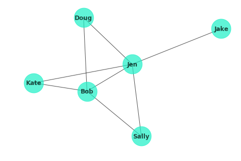

# Introduction to NetworkX

## Introduction

The primary package for analyzing network graphs in Python is NetworkX. In this lesson you'll get a brief introduction to the package, recreating the basic graphs from the previous lesson by adding nodes and edges and then creating a visual.

## Objectives

You will be able to:

- Create basic network graphs with networkx 
- Add nodes and edges to networkx graphs 
- Visualize network graphs with networkx 

## Creating a Graph

Creating the initial graph is incredible simple. Observe: 


```python
import networkx as nx
G = nx.Graph()
```

## Adding Nodes

From there, adding nodes is just as easy. Simply call the `.add_node()` method from you graph instance.


```python
G.add_node('Bob')
```

Of course, you can also combine this with some of your previous Python prowess!


```python
people = ['Sally', 'Kate', 'Jen', 'Jake', 'Doug']
for person in people:
    G.add_node(person)
```

## Adding Edges

Similarly, adding edges is also quite straightforward.


```python
G.add_edge('Bob', 'Sally')
```

Once again, you can also take advantage of your knowledge of Python data structures to create a nested data structure and then feed these pairs into the `.add_edge()` method.


```python
relations = {'Bob': ['Jen', 'Kate'],
            'Jen': ['Bob', 'Sally', 'Jake', 'Doug', 'Kate'],
            'Doug': ['Bob']
            }
for p1 in relations.keys():
    p2s = relations[p1]
    for p2 in p2s:
        G.add_edge(p1, p2)
```

## Visualizing the Graph

Finally, let's take a look at visualizing this graph! The only required parameter to the `nx.draw()` function is specifying the graph itself. In addition, demonstrated below are a number of optional parameters:
* `with_labels` (boolean) - would you like labels for your nodes?
* `node_color` (color) - what color do you want your nodes?
* `node_size` (real) - how big do you want your nodes? (300 is default)
* `alpha` (real) - node transparency, must be between 0 and 1, 1 being the default
* `font_weight` (string) - additional formatting for the label text


```python
%matplotlib inline
nx.draw(G, with_labels=True, node_color='#1cf0c7', node_size=1500, alpha=0.7, font_weight='bold')
```





## Additional Resources
* [NetworkX Documentation](https://networkx.github.io/documentation/stable/index.html)
* [NetworkX Drawing Options Documentation](https://networkx.github.io/documentation/networkx-1.10/reference/generated/networkx.drawing.nx_pylab.draw_networkx_nodes.html) 

## Summary

Well done! In this lesson, you got a brief introduction to using the NetworkX library to create and visualize graph networks. In the upcoming lab, you'll get a chance to practice these skills before moving on to common algorithms and metrics for processing and interpreting network graphs.
