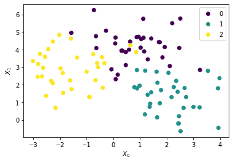
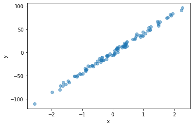

# Generating Data

## Introduction
Data analysis often requires analysts to test the efficiency/performance of an algorithm with a certain type of data. In such cases, the focus is not to answer some analytical questions as we have seen earlier but to test some machine learning hypothesis dealing with, say, comparing two different algorithms to see which one gives a higher level of accuracy. In such cases, the analysts would normally deal with synthetic random data that they generate themselves. This lab and the upcoming lesson will highlight some data generation techniques that you can use later to learn new algorithms while not indulging too much into the domain knowledge.  

## Objectives
You will be able to :

- Identify the reason why data scientists would want to generate datasets
- Generate datasets for classification problems 
- Generate datasets for regression problems 

## Practice datasets

Practice datasets allow for debugging of algorithms and testing their robustness. They are also used for understanding the behavior of algorithms in response to changes in model parameters as we shall see with some ML algorithms. Following are some of the reasons why such datasets are preferred over real-world datasets: 

- Quick and easy generation - save data collection time  and efforts
- Predictable outcomes - have a higher degree of confidence in the result
- Randomization - datasets can be randomized repeatedly to inspect performance in multiple cases
- Simple data types - easier to visualize data and outcomes

In this lesson, we shall cover some of the Python functions that can help us generate random datasets. 

## `make_blobs()`

The official documentation for this function can be found [here](https://scikit-learn.org/stable/modules/generated/sklearn.datasets.make_blobs.html). This function generates isotropic gaussian blobs for clustering and classification problems. We can control how many blobs to generate and the number of samples to generate, as well as a host of other properties. Let's see how to import this in a Python environment: 


```python
# Import make_blobs
from sklearn.datasets import make_blobs
```

Let's now generate a 2D dataset of samples with three blobs as a multi-class classification prediction problem. Each observation will have two inputs and 0, 1, or 2 class values.


```python
# Generate data
X, y = make_blobs(n_samples=100, centers=3, n_features=2, random_state=0)
```


```python
# Preview first 10 rows of X
X[:10]
```


    array([[ 2.63185834,  0.6893649 ],
           [ 0.08080352,  4.69068983],
           [ 3.00251949,  0.74265357],
           [-0.63762777,  4.09104705],
           [-0.07228289,  2.88376939],
           [ 0.62835793,  4.4601363 ],
           [-2.67437267,  2.48006222],
           [-0.57748321,  3.0054335 ],
           [ 2.72756228,  1.3051255 ],
           [ 0.34194798,  3.94104616]])


```python
# Preview first 10 rows of y
y[:10]
```


    array([1, 0, 1, 0, 0, 0, 2, 2, 1, 0])


Now we can go ahead and visualize the results using this code:
    


```python
import matplotlib.pyplot as plt

fig, ax = plt.subplots()
sc = ax.scatter(X[:,0], X[:,1], c=y)
ax.set_xlabel("$X_0$")
ax.set_ylabel("$X_1$")
ax.legend(*sc.legend_elements());
```


    

    


So above we see three different classes. We can generate any number of classes adapting the code above. This dataset can be used with a number of classifiers to see how accurately they perform. 

## `make_moons()`

This function is used for binary classification problems with two classes and generates moon shaped patterns. This function allows you to specify the level of noise in the data. This helps you make the dataset more complex if required to test the robustness of an algorithm. This is how you import this function from scikit-learn and use it: 


```python
from sklearn.datasets import make_moons
X, y = make_moons(n_samples=100, noise=0.1, random_state=0)
```

Now we can simply use the code from last example for visualizing the data: 


```python
fig, ax = plt.subplots()
sc = ax.scatter(X[:,0], X[:,1], c=y, cmap="winter")
ax.set_xlabel("$X_0$")
ax.set_ylabel("$X_1$")
ax.legend(*sc.legend_elements());
```


    

    


The noise parameter controls the shape of the data generated. Give it different values from 0 to 1 above and inspect the outcome. 0 noise would generate perfect moon shapes and 1 would be just noise and no underlying pattern. We can also see that this pattern is not "linearly separable", i.e., we can not draw a straight line to separate classes, this helps us try our non-linear classification functions (like _sigmoid_ and _tanh_ etc.)

 ## `make_circles()` 

This function further complicates the generated data and creates values in the form of concentric circles. It also features a noise parameter, similar to `make_moons()`. Below is how you import and use this function: 


```python
from sklearn.datasets import make_circles
X, y = make_circles(n_samples=100, noise=0.05)
```

Bring in the plotting code from previous examples: 


```python
fig, ax = plt.subplots()
sc = ax.scatter(X[:,0], X[:,1], c=y, cmap="Wistia")
ax.set_xlabel("$X_0$")
ax.set_ylabel("$X_1$")
ax.legend(*sc.legend_elements());
```


    

    


This is also suitable for testing complex, non-linear classifiers. 

 ## `make_regression()`

This function allows you to create datasets that can be used to test regression algorithms. Regression can be performed with a number of algorithms ranging from ordinary least squares method to more advanced deep neural networks. We can create datasets by setting the number of samples, number of input features, level of noise, and much more. Here is how we import and use this function:


```python
from sklearn.datasets import make_regression
X, y = make_regression(n_samples=100, n_features=1, noise=3, random_state=0)
```


```python
fig, ax = plt.subplots()
ax.scatter(X, y, alpha=0.5)
ax.set_xlabel("x")
ax.set_ylabel("y");
```


    

    


We can further tweak the generated parameters to create non-linear relationships that can be solved using non-linear regression techniques:  


```python
# Generate new y 
y2 = y**2
y3 = y**3

# Visualize this data
fig, (ax1, ax2) = plt.subplots(ncols=2, figsize=(12,4))
ax1.scatter(X, y2, alpha=0.5, color="orange")
ax1.set_title("Squared Transformation")
ax2.scatter(X, y3, alpha=0.5, color="cyan")
ax2.set_title("Cubed Transformation")
for ax in (ax1, ax2):
    ax.set_xlabel("x")
    ax.set_ylabel("y")
```


    

    


## Level up (Optional)

`sklearn` comes with a lot of data generation functions. We have seen a few popular ones above. Kindly visit [this link](https://scikit-learn.org/stable/datasets) to look at more such functions (along with some real world datasets). 

## Summary 

In this lesson, we looked at generating random datasets for classification and regression tasks using `sklearn`'s built-in functions. We looked at some of the attributes for generating data and you are encouraged to dig deeper with the official documentation and see what else can you achieve with more parameters. While learning a new algorithm, these synthetic datasets help you take your focus off the domain and work only with the computational and performance aspects of the algorithm. 
